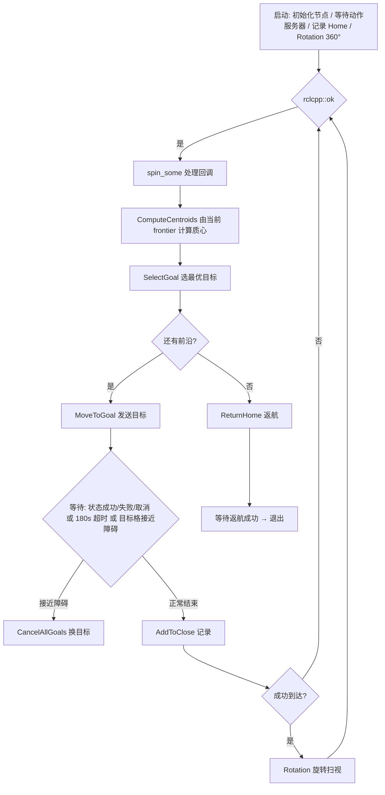
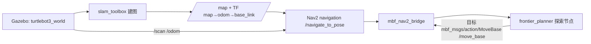

# frontier_exploration 使用说明（ROS 2）

> 基于占用栅格地图的单机器人前沿探索包（ROS 1 → ROS 2 Humble 移植版）。
> 本包只有一个节点 `frontier_planner`：订阅全局地图 → 检测前沿并计算质心 → 通过
> move_base（move_base_flex）动作服务器驱动机器人逐个探索目标 → 全部探索完成后返航。

---

## 1. 依赖

- **ROS 2 Humble**
- 构建/运行依赖（均为 ROS 2 包）：
  - `rclcpp`、`rclcpp_action`
  - `tf2`、`tf2_ros`、`tf2_geometry_msgs`
  - `geometry_msgs`、`nav_msgs`、`visualization_msgs`
  - `mbf_msgs`（move_base_flex 的消息/动作定义，提供 `mbf_msgs/action/MoveBase`）
  - `rosidl_default_generators`、`rosidl_default_runtime`
- 运行时还需外部提供（与本包无关）：
  - **SLAM 地图**：发布 `/map`（`nav_msgs/msg/OccupancyGrid`）的节点，例如 cartographer、slam_toolbox
  - **TF 树**：`map → base_link`（或 `robot_base_frame` 参数指定的 frame）
  - **动作服务器**：在 `/move_base` 上提供 `mbf_msgs/action/MoveBase` 的导航栈，例如 move_base_flex

---

## 2. 构建

```sh
source /opt/ros/humble/setup.bash
cd <你的 colcon 工作区>
colcon build --packages-select frontier_exploration
source install/setup.bash
```

> 如需 move_base_flex 作为动作服务器：`sudo apt install ros-humble-move-base-flex`

---

## 3. 执行

```sh
ros2 run frontier_exploration frontier_planner
```

启动时序（与原版 ROS 1 一致）：

1. 构造 `FrontierDetector` 与 `Actuator`（创建发布器/订阅器/服务/动作客户端）。
2. `Actuator` 会**阻塞等待 `/move_base` 动作服务器**就绪。
3. 通过 TF 获取机器人初始位姿并记录为 `Home`。
4. 执行一次 `Rotation(360.0)` 初始化旋转（需要地图已到达；否则跳过并告警，等待地图）。
5. 进入主循环：探测前沿 → 选点 → 导航 → 重复，直至无前沿可探 → 返航 → 退出。

---

## 4. 话题与接口

### 4.1 订阅（Subscribe）

| 话题 | 类型 | 说明 |
|---|---|---|
| `/map` | `nav_msgs/msg/OccupancyGrid` | 全局地图（探测与执行两个类都订阅，队列 10） |
| `/centroids` | `frontier_exploration/msg/PointArray` | 前沿质心（`Actuator` 用于可视化） |

### 4.2 发布（Publish）

| 话题 | 类型 | 说明 |
|---|---|---|
| `/frontier` | `frontier_exploration/msg/PointArray` | 全部前沿单元点 |
| `/centroids` | `frontier_exploration/msg/PointArray` | 全部前沿质心点 |
| `/inflated_map` | `nav_msgs/msg/OccupancyGrid` | 障碍物膨胀后的地图 |
| `/frontier_vis` | `visualization_msgs/msg/Marker` | 前沿可视化（蓝色 POINTS） |
| `/centroid_vis` | `visualization_msgs/msg/Marker` | 质心可视化（红色 POINTS） |
| `/goal_vis` | `visualization_msgs/msg/Marker` | 当前目标可视化（粉色 SPHERE） |
| `/home_vis` | `visualization_msgs/msg/Marker` | 起点/返航点可视化（绿色 SPHERE） |
| `/cmd_vel` | `geometry_msgs/msg/Twist` | 旋转指令（仅 `Rotation()` 时发布，主题名由 `cmd_topic` 参数决定） |

### 4.3 服务（Service）

| 服务 | 类型 | 说明 |
|---|---|---|
| `get_centroids` | `frontier_exploration/srv/GetCentroids` | 按需重新计算前沿质心并返回 |

### 4.4 动作（Action，客户端）

| 动作服务器 | 动作类型 | 用途 |
|---|---|---|
| `/move_base` | `mbf_msgs/action/MoveBase` | 发送/取消导航目标；等待目标状态（SUCCEEDED/ABORTED/CANCELED/超时） |

---

## 5. 核心参数

全部参数在 `frontier_planner` 节点命名空间下声明（默认值见下表）。可用 `ros2 param` 查看/设置。

| 参数 | 类型 | 默认值 | 说明 |
|---|---|---|---|
| `obstacle_inflation` | float | `0.3` | 障碍物膨胀半径（m） |
| `map_revolution` | float | `0.1` | 地图分辨率（m/cell），用于 Marker 尺寸 |
| `cmd_topic` | string | `"cmd_vel"` | 速度指令话题名 |
| `robot_base_frame` | string | `"base_link"` | 机器人基座 frame（TF 查询用） |
| `goal_tolerance` | float | `0.2` | 判定"已到达/已探索"的目标容差（m） |
| `obstacle_tolerance` | float | `0.5` | 距障碍物小于该值（m）时禁止原地旋转 |
| `rotate_speed` | float | `0.5` | 原地旋转角速度（rad/s） |

> 另有内部常量 `Limit = 180`：单个目标导航的最长等待时间（秒），超时则更换目标。

---

## 6. 算法与数据流（Mermaid 流程图）

```mermaid
flowchart TD
    subgraph Detector["FrontierDetector"]
        M[订阅 /map\nnav_msgs/OccupancyGrid] --> RAW[raw_map]
        RAW --> INFL[InflateMap\n按 obstacle_inflation 膨胀障碍物]
        INFL --> IM[inflated_map\n发布 /inflated_map]
        IM --> FRONT[ComputeFrontier\n自由格且邻域含未知格 → 前沿点]
        FRONT --> F[frontier\n发布 /frontier]
        F --> CENT[ComputeCentroids\nGrouping 分组 → Sort 排序 → 过滤过近/碰撞质心]
        CENT --> C[centroids\n发布 /centroids]
        IM & F & C --> VIS[Visualization\n发布 /frontier_vis /centroid_vis]
    end

    subgraph Actuator["Actuator"]
        M2[订阅 /map] --> RAW2[raw_map]
        C2[订阅 /centroids] --> CEN2[centroids]
        TF[TF map→base_link] --> POSE[robotPose]
        POSE & RAW2 & CEN2 --> SELECT[SelectGoal\n代价 = 距离 × (1 + sigmoid(碰撞惩罚))\n跳过 GoalClose 中的已探点]
        SELECT --> G[Goal]
        G --> MTG[MoveToGoal\nasync_send_goal → /move_base]
        MTG --> WAIT{等待目标状态\nSUCCEEDED / ABORTED / CANCELED / 180s 超时}
        WAIT -->|目标格接近障碍 >=65| CANCEL[CancelAllGoals → 更换目标]
        WAIT -->|成功| ADDCLOSE[AddToClose 记录已探目标]
        ADDCLOSE --> ROT[Rotation 原地旋转扫视]
    end

    START[启动] --> Detector
    START --> Actuator
    SELECT -->|无前沿或全部已探 GoHomeFlag=1| HOME[ReturnHome → 返航 /move_base → SUCCEEDED 后退出]

    WAIT -.->|主循环迭代| IM
    WAIT -.->|主循环迭代| F
```

**探索主循环逻辑（`frontierMain.cpp`）：**



---

## 7. 注意事项

- **启动顺序**：建议先启动 SLAM（`/map`）与导航栈（move_base_flex），再启动本节点；否则节点会在等待动作服务器/TF 处阻塞。
- **地图帧**：目标点按 `map` 帧发送（本包不发布 `inflated_map` 的 TF）。请确保 `map → base_link` TF 可用。
- **可视化**：RViz 中显示 `/frontier_vis`、`/centroid_vis`、`/goal_vis`、`/home_vis` 与 `/inflated_map` 即可观察探索过程。
- **服务调试**：`ros2 service call /get_centroids frontier_exploration/srv/GetCentroids '{}'` 可手动触发一次质心计算。
- 本仓库 `launch/`、`config/`、`urdf/`、`world/`、`meshes/` 为 ROS 1 遗留仿真资产，不参与本 ROS 2 包的构建。

---

## 8. 仿真运行（TurtleBot3 + Gazebo + Nav2）

一个命令即可拉起整套仿真：Gazebo（turtlebot3_world 迷宫）→ slam_toolbox 建图 →
Nav2 导航 → 桥接 → 探索节点。

### 8.1 依赖（ROS 2 Humble apt 包）

```sh
sudo apt install ros-humble-turtlebot3-description ros-humble-turtlebot3-gazebo \
  ros-humble-turtlebot3-navigation2 ros-humble-turtlebot3-cartographer \
  ros-humble-turtlebot3-teleop ros-humble-gazebo-ros ros-humble-navigation2 \
  ros-humble-slam-toolbox
```

### 8.2 运行

```sh
source /opt/ros/humble/setup.bash
cd <工作区>
colcon build --packages-select mbf_nav2_bridge frontier_exploration
source install/setup.bash
ros2 launch frontier_exploration frontier_sim.launch.py
```

- 默认 **Gazebo 无头**（只跑 gzserver，避免 GUI 渲染卡顿），**RViz 打开**并显示探索可视化。
- 可选参数：
  - `gui:=true`：同时打开 Gazebo GUI（gzclient）。
  - `world:=<某.world 完整路径>`：换世界，例如
    `/opt/ros/humble/share/turtlebot3_gazebo/worlds/turtlebot3_house.world`。

### 8.3 RViz 显示

`frontier_sim.launch.py` 会自动打开 RViz（配置 `config/rviz/frontier_exploration.rviz`），
包含以下显示：`/map`（slam 建图）、`/inflated_map`（膨胀图，costmap 配色）、
`/frontier_vis`（前沿，蓝色点）、`/centroid_vis`（质心，红色点）、
`/goal_vis`（当前目标，粉色球）、`/home_vis`（返航点，绿色球）、`/scan`、机器人模型。

### 8.4 仿真架构



> **`mbf_nav2_bridge`**（工作区 `src/mbf_nav2_bridge`，Python）：本库探索节点仍按原设计向
> `/move_base` 发送 `mbf_msgs/action/MoveBase`；桥接在 `/move_base` 上提供该动作服务器，
> 把目标转发给 Nav2 的 `/navigate_to_pose`，并翻译取消/结果。这样探索库零改动即可驱动 Nav2。
>
> 也可用 `mbf_simple_nav` 代替（需另装 MBF 的 planner/controller 插件），不推荐。

### 8.5 观察与验证

```sh
ros2 topic echo /map --once                      # 建图结果
ros2 action list                                  # /move_base, /navigate_to_pose ...
ros2 topic echo /frontier --once                 # 前沿点
ros2 topic echo /odom --once                     # 机器人位姿（应随时间变化）
# 探索节点日志（launch 输出中）：
#   Found frontier cells: N / Found frontier: M   → 前沿与质心数
#   Iteration: k  Goal: (x, y)  Distance: d      → 当前目标
#   Reached the goal!                             → 到达一个前沿目标
```

停止：`Ctrl-C` 结束 launch（会关闭 Gazebo/Nav2/探索节点）。

---

## 9. 相关文档

- 设计文档：`docs/superpowers/specs/2026-08-24-frontier-exploration-ros2-port-design.md`
- 实现计划：`docs/superpowers/plans/2026-08-24-frontier-exploration-ros2-port.md`
