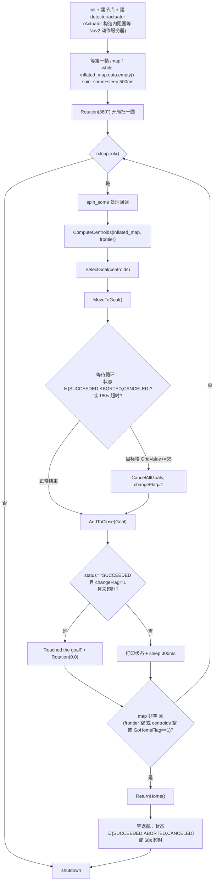

# frontier_exploration 学习笔记（ROS 2）

> 本文记录学习本包的过程：先给出**推荐学习路线**，再逐层拆解**整体架构**、**关键代码**、
> **算法细节**、**已知缺陷与修复**，最后给出**动手实验**和**自查问题**。
>
> 阅读对象：具备 ROS 2 基础（topic/service/action/TF）、C++ 基础、了解占据栅格地图概念的人。
>
> 相关文档：
> - 使用说明 `docs/USAGE.md`（接口/参数速查）
> - 移植设计 `docs/superpowers/specs/2026-08-24-frontier-exploration-ros2-port-design.md`
> - 移植计划 `docs/superpowers/plans/2026-08-24-frontier-exploration-ros2-port.md`
> - 移植过程记录 `.superpowers/sdd/progress.md`（含逐条 review 发现，很值得读）

---

## 0. 一句话概括

这是一个 **基于占据栅格地图的单机器人前沿探索（frontier-based exploration）** 包，
算法本体逐行移植自 ROS 1 版本，只把 API 从 ROS 1 迁到了 ROS 2 Humble：

```
订阅 /map ──▶ 膨胀障碍物 ──▶ 找前沿单元 ──▶ 聚类成组 ──▶ 算质心 ──▶ 选最优目标
                                                                      │
                        到达/失败/超时 ◀── Nav2 /navigate_to_pose ◀────┘
                                     │
                          无前沿可探 ──▶ 返航 ──▶ 退出
```

**本包只做"感知 + 决策"**：不发布地图、不做定位、不做路径规划。
地图来自 slam_toolbox/cartographer，TF 来自定位，路径规划与运动控制全交给 Nav2。

---

## 1. 推荐学习路线（分 6 步）

学习一个陌生机器人包，建议按"先跑起来 → 再看接口 → 再啃算法 → 最后动手改"的顺序。

| 阶段 | 目标 | 做什么 | 产出 |
|---|---|---|---|
| **S0 跑起来** | 建立感性认识 | 按 `USAGE.md` 第 8 节起仿真，看 RViz 里蓝点(前沿)/红点(质心)/粉球(目标)动起来 | 能描述"机器人在干什么" |
| **S1 看接口** | 搞清输入输出 | 读 `CMakeLists.txt`、`package.xml`、`msg/PointArray.msg`、`srv/GetCentroids.srv` | 画出 topic/service/action 清单（见 §2.4） |
| **S2 读感知** | 地图 → 前沿 → 质心 | 按调用顺序读 `mapCallback → InflateMap → ComputeFrontier → ComputeCentroids → Grouping/Sort` | 画出 §3 的流水线 |
| **S3 读决策** | 质心 → 目标 → 动作 | 读 `Actuator::SelectGoal`（代价函数）、`MoveToGoal`（action 客户端） | 说清"为什么选这个目标" |
| **S4 读主循环** | 串起全局 | 读 `frontierMain.cpp`，整理成状态机（§4） | 画出主循环流程图 |
| **S5 动手改** | 验证理解 | 调参数、加日志、用服务手动触发质心计算、复现 §6 的缺陷 | 能改出可见的 behavior 变化 |

> **建议**：S2/S3 时**不要在 IDE 里一次性读完所有函数**。先在 `frontierMain.cpp` 主循环里
> 找到调用点，再顺着调用链跳进去，每次只看一层，读完立刻回到主循环。这个包的主循环不到
> 100 行，三个文件互相引用的关系很清晰，用"主循环视角"读效率最高。

---

## 2. 整体架构

### 2.1 包结构（构建视角）

包名 `frontier_exploration`（注意：**文件夹名**是 `frontier_exploration_occupancygrid`，
但 CMake 里 `project(frontier_exploration)`、package.xml 里 `<name>frontier_exploration</name>`，
所以 `ros2 run frontier_exploration ...` 用的是后者）。

```
CMakeLists.txt / package.xml      ── ament_cmake + rosidl
msg/PointArray.msg                ── geometry_msgs/Point[] points
srv/GetCentroids.srv              ── 请求 frontiers → 响应 centroids
include/frontier_exploration/
  ├── frontier_detector.h         ── 感知类
  └── actuator.h                  ── 决策+执行类
src/
  ├── frontier_detector.cpp       ┐
  ├── actuator.cpp                ├─ 编成库 frontierDetector
  └── frontierMain.cpp            ── 编成可执行 frontier_planner（链接上面的库）
launch/ config/ urdf/ world/ meshes/   ── ROS 1 遗留资产，不参与 ROS 2 构建
```

`CMakeLists.txt` 的构建产物只有两个：

- `add_library(frontierDetector ...)` — 库，含 detector + actuator（`CMakeLists.txt:26`）
- `add_executable(frontier_planner src/frontierMain.cpp)` — 唯一节点（`CMakeLists.txt:46`）

接口用 `rosidl_generate_interfaces` 生成（`CMakeLists.txt:20`）。

### 2.2 类关系（**关键设计点**）

```
frontierMain.cpp
  │
  ├─ 创建唯一节点 node = make_shared<rclcpp::Node>("frontier_planner")
  │
  ├─ FrontierDetector frontier_detector(node)   ── 共享同一个 node
  └─ Actuator          actuator(node)           ── 共享同一个 node
```

**重要**：两个类都**不是** `rclcpp::Node` 的子类，而是普通 C++ 类，构造函数接收
`rclcpp::Node::SharedPtr`，用这个 node 去 create_publisher / create_subscription /
create_service / create_client。全包**只有一个** ROS 2 节点。这是从 ROS 1 的
"传 `ros::NodeHandle`" 写法直接映射过来的（见设计文档 4.2 的 API 映射表）。

### 2.3 两类的职责边界

| | `FrontierDetector`（感知） | `Actuator`（决策+执行） |
|---|---|---|
| 输入 | `/map` | `/map`、`/centroids`、TF `map→base_link` |
| 输出 | `/frontier`、`/centroids`、`/inflated_map`、可视化 Marker、`get_centroids` 服务 | `/navigate_to_pose` 动作目标、`/cmd_vel`（仅旋转）、`/goal_vis`、`/home_vis` |
| 状态 | `raw_map`、`inflated_map`、`frontier`、`centroids` | `Goal`、`Home`、`GoalClose`、`GoHomeFlag`、`robotPose`、`goal_handle_` |
| 核心方法 | `InflateMap` / `ComputeFrontier` / `ComputeCentroids` / `Grouping` | `SelectGoal` / `MoveToGoal` / `Rotation` / `ReturnHome` |

> 两类**都订阅 `/map`**，各自持有一份 `raw_map` —— 因为 `Actuator` 的碰撞检测
> （`CheckCollision`）需要原始地图，而 `FrontierDetector` 需要它来膨胀。
> 注意 `Actuator` 订阅 `/centroids` 只是为了让自己的可视化更新（`centroidCallback`），
> 选目标时用的是**主循环直接传进来的** `frontier_detector.centroids`。

### 2.4 运行时接口全景（S1 的产出）

```
                    ┌──────────────────────────────┐
   /map ───────────▶│                              │
 (OccupancyGrid)    │        FrontierDetector      │──▶ /frontier      (PointArray)
                    │  InflateMap→Frontier→Centroid│──▶ /centroids     (PointArray)
                    │                              │──▶ /inflated_map  (OccupancyGrid)
                    └──────────────────────────────┘──▶ /frontier_vis /centroid_vis (Marker)
                    ▲
                    │ get_centroids (srv)  ← 调试用，手动触发一次质心计算
                    │
   /map ───────────▶┌──────────────────────────────┐
   TF  ────────────▶│           Actuator           │──▶ /navigate_to_pose (action, Nav2)
   /centroids ─────▶│  SelectGoal→MoveToGoal→Home  │──▶ /cmd_vel (Twist，仅 Rotation)
                    └──────────────────────────────┘──▶ /goal_vis /home_vis (Marker)
```

### 2.5 依赖全景（谁提供什么）

```
Gazebo ──▶ /scan /odom
slam_toolbox ──▶ /map + TF(map→odom→base_link)
Nav2 ──▶ /navigate_to_pose 动作服务器（消费目标）
frontier_planner ──▶ 消费 /map、TF，产出目标给 Nav2
```

启动顺序很关键：**先 SLAM + Nav2，再本节点**。否则节点会阻塞在
"等待动作服务器" 或 "等待第一帧 /map"（`USAGE.md` §7）。

---

## 3. 关键代码逐层拆解：感知流水线

### 3.1 入口：`mapCallback`（`frontier_detector.cpp:88`）

每来一帧 `/map` 就完整跑一遍流水线：

```cpp
raw_map.info = raw_map->info;  raw_map.data = raw_map->data;   // 存一份原始地图
InflateMap(raw_map, inflated_map);         // ① 膨胀障碍物
ComputeFrontier(inflated_map);             // ② 提取前沿单元
Frontier.points = frontier;  Centroids.points = centroids;
FrontierPub_->publish(Frontier);           // ③ 发布 /frontier
if (!centroids.empty()) CentroidsPub_->publish(Centroids);
Visualization();                           // ④ 发 Marker
```

注意：**这里只算了 `frontier`，没有算 `centroids`**。质心是主循环显式调用
`ComputeCentroids()` 才算的（`frontierMain.cpp:43`）。所以 `/centroids` 话题里发的
其实是**上一轮**的质心。这是理解数据流的第一个坑。

### 3.2 ① `InflateMap`（`frontier_detector.cpp:151`）

```cpp
int dilate_amount = round(OBSTABLE_INFLATION / raw_map.info.resolution);  // 0.3/0.05 = 6 格
for 每个格子 (x,y):
  if (0 <= v < 65)  → inflated = 0     (自由格)
  if (v == -1)      → continue         (未知格保持 -1)
  else (v >= 65)    → 在 ±dilate_amount 的方形窗口内全部写 100   (障碍膨胀)
```

要点：
- 结果是**种类极简**的地图：只有 `0`（自由）、`-1`（未知）、`100`（膨胀后的障碍）三种值。
- 膨胀窗口是**方形（切比雪夫距离）**，不是圆形欧氏膨胀。所以"膨胀 0.3 m"实际是在
  对角方向也膨胀 0.3 m，角落比预期更保守。
- 原地修改策略是 `inflated_map = raw_map` 先整体拷贝，再逐格覆盖。

### 3.3 ② `ComputeFrontier` + `CheckNeibor`（`frontier_detector.cpp:180` / `:24`）

前沿单元的定义：**自己是自由格，且 3×3 邻域里有未知格**。

```cpp
// ComputeFrontier
if (data[n] >= 0 && data[n] < 35 && CheckNeibor(map, n) == 1)  → 是前沿点

// CheckNeibor：3×3 邻域
if ( (nb >= 35 && nb < 65) || nb == -1 )  → 邻域含未知 → 返回 1
```

世界坐标换算（注意 `fabs`，见 §6 缺陷）：

```cpp
p.x = (n_x + 0.5) * resolution - fabs(origin.position.x);
p.y = (n_y + 0.5) * resolution - fabs(origin.position.y);
```

> **观察点**：`CheckNeibor` 里 `35 <= v < 65` 这个分支在 `InflateMap` 之后其实永远不成立
> （膨胀图只有 0 / -1 / 100）。它是为了兼容原始 SLAM 地图里的中间代价值保留的。
> 读代码时要能识别这种"实际上走不到的分支"。

### 3.4 ③ `ComputeCentroids`：前沿 → 质心（`frontier_detector.cpp:203`）

这是全包最核心也最绕的一段，分四步：

```
对每个 frontier 点 f（跳过已在 frontierClose 里的）:
  1. pointGroup = [f];  frontierClose += f
  2. Grouping(f)        → 沿连通邻域递归收集同一条前沿链上的所有点，塞进 pointGroup
  3. Sort(pointGroup)   → 按"图像索引"降序冒泡排序
  4. if (size <= 6) 丢弃        ← 过滤太短的前沿
     else raw_centroids += pointGroup[ceil(size/2)]   ← 取排序后的中点当质心
然后:
  5. 近邻去重：两质心距离 < 3 m 且连线无碰撞 → 丢掉后一个
  6. 把没被丢掉的 raw_centroids 复制进 centroids
```

几个必须理解的点：

- **`Grouping` 是"沿链走"而不是标准 flood fill**（`frontier_detector.cpp:295`）。
  函数内层一旦找到**第一个**邻居就 `out=1; break`，然后对那个邻居递归。所以它是
  **深度优先地顺着一条前沿走**，把一条连续前沿链收集起来。递归深度 = 该前沿链长度。
- **质心不是几何平均，而是排序后的"中位数点"**。`Sort` 按图像索引
  `y*width + x` 降序排（`frontier_detector.cpp:346`，用的是 O(n²) 冒泡），
  然后取 `pointGroup[ceil(size/2)]`。所以质心**一定落在某个前沿单元上**，
  而不是整组的几何中心。这是"质心"这个名字容易误导的地方。
- `int index = int(ceil(pointGroup.size() / 2));` —— 整数除法让 `ceil` 变成空操作
  （`size/2` 已经是整数），且当 size 为奇数时取的是**偏小**的中间点。属继承缺陷，
  见 §6。
- 服务 `get_centroids`（`centroidCallback`，`frontier_detector.cpp:105`）走的是同一函数，
  可以拿它做**不依赖主循环的单元调试**。

### 3.5 ④ 碰撞检测 `FrontierDetector::CheckCollision`（`frontier_detector.cpp:270`）

沿线段以 `resolution` 为步长采样，统计 `>=70` 的格子数，`count > 2` 就返回 false。

> ⚠️ **命名陷阱**：它叫 `CheckCollision`，但语义是**"这条线段是否通畅"**——
> 返回 `true` 表示**无碰撞**。`ComputeCentroids` 里正是这么用的（`if (... && CheckCollision(...))` 才去重）。
> `Actuator` 里**同名但语义不同**的函数返回的是碰撞**计数**（`actuator.cpp:279`），
> 用于代价函数。同名不同义，是两个类里独立的函数，读的时候别串了。
>
> ⚠️ **循环条件陷阱**：`while (fabs(x_check-end.x) > STEP && fabs(y_check-end.y) > STEP)`
> 用的是 `&&`。当线段水平（Δy=0）或垂直时，其中一个条件一开始就是 false，
> **整个循环一次都不执行**，直接返回"通畅"。轴对齐的线段永远不会被检测碰撞。

---

## 4. 关键代码逐层拆解：决策与执行

### 4.1 `Actuator` 构造与初始化（`actuator.cpp:319`）

```cpp
ActuatorInit();                       // 读参数、初始化 RotSpeed/MoveGoal
VisInit();                            // 初始化 Goal/Home Marker
ac_ = create_client<NavGoalAction>(node, "navigate_to_pose");
while (!ac_->wait_for_action_server(1s)) { ... }   // 阻塞等待 Nav2
ObtainPose();  Home = robotPose.Position;  Goal = Home;   // 起点记为 Home
cmdPub = create_publisher<Twist>(CmdTopic, 1000);
```

两个细节值得记：
- `MoveGoal.pose.header.frame_id = "map"` 在 `ActuatorInit` 里设置（`actuator.cpp:216`）。
  早期版本这里是 `inflated_map`（没有任何节点发布这个 frame），是移植 review 抓出来的
  Important 缺陷，已修。
- `Home` 是**节点构造时刻机器人所在的位姿**，也就是"建图原点附近"。

### 4.2 `SelectGoal`：代价函数（`actuator.cpp:229`）—— 决策核心

```cpp
for 每个质心 c:
  // (a) 跳过已经探索过的（GoalClose 内且距离 < GoalTolerance 的）
  if (GoalClose 里有 c 附近点) { GoalClose += c; count++; continue; }

  // (b) 代价 = 欧氏距离 × (1 + 碰撞惩罚系数)
  temp     = dist(robotPose, c);
  collision = CheckCollision(raw_map, robotPose.Position, c);   // ← 返回碰撞计数
  sigmoid   = 2/(1+exp(-0.3*collision)) - 1;                    // collision>=0 → [0,1)
  temp     = temp * (1 + sigmoid);

  if (temp < shortest) { shortest = temp; index = i; }

if (count == centroids.size()) { GoHomeFlag = 1; return Home; }  // 全探完 → 标记返航
Goal = centroids[index];
```

**这是本包唯一"聪明"的地方**，读懂它就懂了整个策略：

- **贪心**：永远选当前代价最小的，不考虑长期收益/信息增益。
- **代价 ≈ 距离，被碰撞惩罚放大最多 2 倍**：`sigmoid ∈ [0,1)`，所以
  `temp ∈ [dist, 2*dist)`。即"宁可多跑一倍路程，也不穿障碍"——但只是软约束，
  距离足够近的碰撞目标依然可能被选中（这正是主循环里那个"目标格接近障碍就取消"
  的兜底逻辑存在的原因）。
- **`GoalClose` 是记忆**：已到达/放弃的目标被记进去，避免来回震荡（`AddToClose`）。
- **`GoHomeFlag` 是终止信号**：所有质心都进过 `GoalClose` 时置 1，主循环据此返航。

> ⚠️ `index` 初值 0，但若所有候选代价都 ≥ 10000（约 5 km）则循环体不更新
> `shortest/index`，会用 `index=0`——继承缺陷（见 §6），实际中距离不会那么大。

### 4.3 `MoveToGoal`：ROS 1 action → ROS 2 action（`actuator.cpp:92`）

```cpp
goal_handle_ = nullptr;                      // 清掉上一目标的句柄
MoveGoal.pose.pose.position = Goal;          // frame 已在 ActuatorInit 设为 map
MoveGoal.pose.pose.orientation.w = 1.0;      // 只关心位置，朝向不约束
MoveGoal.pose.header.stamp = node_->now();

SendGoalOptions opts;
opts.goal_response_callback = [this](handle){ if (handle) goal_handle_ = handle; };
opts.result_callback        = [](result){ /* 状态由主循环查 goal_handle_ */ };
ac_->async_send_goal(MoveGoal, opts);
```

对照 ROS 1 的 `SimpleActionClient::sendGoal` + `getState()`：
ROS 2 用 **`async_send_goal` 拿 `goal_handle_`**，之后主循环反复
`goal_handle_->get_status()`（包装在 `GetGoalStatus()` 里，`actuator.cpp:308`）
轮询状态。这是 ROS 2 action 编程的典型模式，值得单独记住。

状态常量集合（主循环用到）：`STATUS_SUCCEEDED` / `STATUS_ABORTED` /
`STATUS_CANCELED` / `STATUS_UNKNOWN`（来自 `rclcpp_action::GoalStatus`）。

### 4.4 `Rotation`：原地旋转扫视（`actuator.cpp:25`）

```cpp
if (raw_map 为空) return;                    // 空地图保护（移植新增）
ObtainPose();
// 附近 obstacle_tolerance 米内有 >=70 的格子 → 拒绝旋转
for 邻域格子: if (data >= 70) { "Position close to obstacle"; return; }

while (rotated_angle < angle && ok() && duration < 15s) {
  old_yaw = robotPose.Yaw;
  cmdPub->publish(RotSpeed);                 // 直接发 /cmd_vel 角速度
  ObtainPose();
  spin_some(node_);
  dYaw = robotPose.Yaw - old_yaw;            // 累加角度增量
  if (跨过 0/360 边界) 修正 dYaw;            // Yaw 在 [0,360) 度
  rotated_angle += dYaw;
}
```

这是**唯一**直接发 `/cmd_vel` 的地方——其余运动全交给 Nav2。
`Rotation(360.0)` 用于开局扫一圈建立初始地图；`Rotation(0.0)` 在到达目标后调用，
实际上因为 `0 < 0` 不成立而**直接返回**（算是无害的空调用）。

### 4.5 `ObtainPose`：TF 取位姿（`actuator.cpp:160`）

```cpp
try { transform = tf_buffer_.lookupTransform("map", RobotBase, TimePointZero); ... }
catch (TransformException&) { sleep(100ms); continue; }   // 失败保持上一次有效位姿
robotPose.Yaw = 180 * Yaw / PI;   // 角度制，归一化到 [0,360)
```

TF 失败时**不会清空** `robotPose`，保留上一次有效值（移植 review 的修复点），
避免调用方拿到 (0,0,0) 产生错误的距离/朝向计算。

---

## 5. 主循环：把一切串起来（`frontierMain.cpp`）

### 5.1 状态机



### 5.2 三个可以直接学习的 ROS 2 惯用法

1. **"等第一帧地图"的写法**（`frontierMain.cpp:28`）：
   ```cpp
   while (rclcpp::ok() && node->get_...empty()) {
     rclcpp::spin_some(node);                       // 不 spin 回调永远不会被调用
     rclcpp::sleep_for(std::chrono::milliseconds(500));
   }
   ```
   自己写单线程节点时，**阻塞等待前必须 spin**，否则订阅回调不执行、数据永远不来。

2. **单线程节点 + `spin_some` 手写主循环**：整个程序不用 `rclcpp::spin()`，
   而是在自己的 `while` 里反复 `spin_some(node)`。好处是能把"探索逻辑"写在主线程的
   顺序代码里；代价是 `spin_some` 没有频率限制，是个忙等循环（见 §6）。

3. **`ChangeFlag` + `CancelAllGoals` 兜底**：Nav2 会因为目标在膨胀障碍里而 ABORTED，
   主循环在等待期间主动检查目标格的 `GridValue`，一旦 `>=65` 立刻取消换目标
   （`frontierMain.cpp:61`），不傻等 180s。

### 5.3 终止条件里的坑（移植修复的重点）

原始 ROS 1 逻辑有几个会让机器人**卡死或空转**的问题，本包都打了补丁，注释就写在代码里
（`frontierMain.cpp:77`、`:99`、`:107`），非常值得对照阅读：

| 位置 | 问题 | 修复 |
|---|---|---|
| `:28` | 首帧地图没到就 `Rotation(360°)`，扫不到环境 → 立刻判定探索完成返航 | 先等 `inflated_map` 非空再旋转 |
| `:81` | 原来"非超时退出"就算到达，Nav2 快速 ABORT 掉不可达目标时机器人原地不动 | 只有 `STATUS_SUCCEEDED` 才算到达 |
| `:101` | "有前沿但算不出质心"（残片前沿分组≤6 被丢）时既不探索也不返航，空转 | 把 `centroids.size()==0` 也算探索完成 |
| `:107` | 返航目标被 ABORTED 时只等 SUCCEEDED → 永久卡死 | 改为 成功/失败/取消/60s 超时 任一即退出 |

> 这段是**本仓库相对上游 ROS 1 版本最有价值的部分**：它记录了"把算法搬到一个
> 真实的异步导航栈上"时会踩到的行为差异。学习时建议逐条对照原版理解。

---

## 6. 已知缺陷 / 怪癖清单（读代码时的"红笔标注"）

这些大部分是**逐行移植时继承下来的**，记录在 `.superpowers/sdd/progress.md`，
理解它们能避免你把 bug 当成特性去模仿：

| 位置 | 现象 | 影响 | 备注 |
|---|---|---|---|
| `frontier_detector.cpp:8` | `GridValue` 用 `fabs(origin.x)` 换算索引 | origin 为正时索引错位 | 继承；地图原点在负半轴时不出问题 |
| `frontier_detector.cpp:12` | 索引未做边界检查 | 越界读 | 已加空地图/分辨率保护 |
| `frontier_detector.cpp:228` | `ceil(size/2)` 整数除法 | `ceil` 无效，质心偏一 | 继承 |
| `frontier_detector.cpp:282` | 采样循环用 `&&` | 水平/垂直线段不检测碰撞 | 继承 |
| `frontier_detector.cpp:273` | `CheckCollision` 除以 `length` 无零保护 | start==end 时 NaN | 继承 |
| `actuator.cpp:286` | 同上，`Actuator::CheckCollision` 同样问题 | NaN | 继承 |
| `actuator.cpp:258` | `sigmoid` lambda 捕获 `collision` 后立即调用 | 纯粹是内联写法，非必要 | 可简化 |
| `actuator.h:20` | 全局 `const double PI` | 命名空间污染 | 建议挪进命名空间 |
| `frontier_detector.h:21` | `rclcpp::Clock().now()` 默认成员初始化 | 每次构造临时 Clock | 无害 |
| `frontierMain.cpp:54` | `spin_some` 无频率限制的忙等 | CPU 占用高 | 可加小 sleep |
| `actuator.cpp:347` | 析构函数里 `VisInit()` | 无意义 | 无害 |
| 全包 | 状态输出用 `std::cout` 而非 `RCLCPP_*` | 不走 ROS 日志 | 仅一处 `ROS_INFO` 改成了 `RCLCPP_INFO` |

> `Grouping` 是**递归**实现，前沿链很长时递归深度 = 链长，理论上可能爆栈。
> 这是练习"把递归改成显式栈"的好素材。

---

## 7. 动手实验（S5）

### 7.1 只看不建图：手动触发质心计算

```sh
ros2 service call /get_centroids frontier_exploration/srv/GetCentroids '{}'
```
不必等主循环，就能观察 `ComputeCentroids` 的输入输出（日志会打印
`pop_index / raw_centroids / centroids` 三个数量）。

### 7.2 观察数据流

```sh
ros2 topic hz   /map
ros2 topic echo /frontier  --once | head -20
ros2 topic echo /centroids --once
ros2 topic echo /inflated_map --once     # 看膨胀效果
ros2 action list                          # 找 /navigate_to_pose
```

### 7.3 调参实验（体会每个参数的作用）

| 参数 | 尝试 | 预期现象 |
|---|---|---|
| `obstacle_inflation` 0.3 → 0.6 | 增大膨胀 | 前沿点整体后退，机器人更远离墙；走廊可能被"堵死"导致前沿消失 |
| `goal_tolerance` 0.7 → 0.2 | 减小 | 更容易重复选到相近目标；`GoalClose` 去重变弱 |
| `obstacle_tolerance` 2.0 → 0.5 | 减小 | `Rotation` 更容易被允许执行（此前 2 m 内有障碍就拒绝旋转） |
| `rotate_speed` 1.0 → 0.3 | 减小 | 开局 360° 旋转慢，可能撞上 15 s 时限而中断 |
| 代码里 `Limit = 180` → 30 | 缩短单目标超时 | 探索更"急躁"，更容易放弃远目标 |

> 当前工作区的 `frontier_sim.launch.py` 把 Gazebo 和 Nav2 的 `IncludeLaunchDescription`
> **整段注释掉了**（只启动 RViz + `frontier_planner`）。要跑完整仿真，需先单独起
> Gazebo+SLAM+Nav2，再 launch 本文件；或把注释恢复。

### 7.4 用 RViz 验证理解

对照 §3 的流水线，在 RViz 里逐一确认：
`/map`（灰白图）→ `/inflated_map`（障碍变胖）→ `/frontier_vis`（蓝点贴在已探边界）
→ `/centroid_vis`（红点落在蓝点链中间）→ `/goal_vis`（粉球=被选中的红点）
→ `/home_vis`（绿球=起点）。

### 7.5 进阶练习

1. 给 `ComputeCentroids` 加一个 RCLCPP_DEBUG，打印每次 `Grouping` 得到的分组大小，
   观察"≤6 就丢弃"过滤掉了多少噪声前沿。
2. 把 `Grouping` 的递归改成显式 `std::stack`，行为保持一致。
3. 把代价函数从 `dist × (1+sigmoid)` 改成加上"信息增益"项（如该前沿组的大小），
   观察探索轨迹变化。
4. 试着把 §6 的 `&&` 改成 `||`，看近邻去重是否变得更稳定。
5. 用 `ros2 param set /frontier_planner obstacle_inflation 0.8` 运行时动态调参
   （注意：detector 只在 `InflateMap` 里读一次成员，`declare/get` 在 `InitDetector`，
   运行中改参数**不会**生效——这本身是个值得发现的点）。

---

## 8. 同工作区的相关工程（对比学习）

`src/` 下还有几个**未纳入本 git 仓库**的相关包，可作为对比阅读：

| 目录 | 定位 |
|---|---|
| `frontier_exploration_ros2` | 另一个 ROS 2 前沿探索实现（有 plugin 目录，可能是 Nav2 插件形式） |
| `mrtsp_exploration_ros2` | RSP/多机器人探索（Python） |
| `rrt-explore` | 基于 RRT 的探索（C++） |
| `Autonomous-Explorer-and-Mapper-ros2-nav2` | Python 版自主建图探索 |

建议在读完本包后，挑一个读它的目标选择策略（信息增益 / 旅行商 / RRT），
与本包"贪心距离+碰撞惩罚"对比，理解前沿探索的**策略层**其实差异很大而**感知层**
（膨胀→前沿→聚类→质心）高度相似。

---

## 9. 自查问题（读完自测）

**接口层**
1. `ros2 run` 后面的包名是哪个？和文件夹名一致吗？
2. 全包有几个 `rclcpp::Node`？`FrontierDetector`/`Actuator` 是节点吗？
3. 哪些话题是 `FrontierDetector` 发的、哪些是 `Actuator` 发的？
4. 为什么两类都订阅 `/map`？

**感知层**
5. 前沿单元的**定义**是什么（两个条件）？
6. `InflateMap` 之后的图里可能出现哪些数值？`CheckNeibor` 的 `35..65` 分支会出现吗？
7. "质心"是几何中心还是某个前沿点？取哪个点？
8. 前沿组小于等于几个点会被丢弃？为什么会出现"只剩残片前沿、算不出质心"？

**决策层**
9. 代价函数的公式是什么？碰撞惩罚的取值范围与物理含义？
10. `GoalClose` 和 `GoHomeFlag` 各解决什么问题？
11. `MoveToGoal` 如何拿到并跟踪目标状态（对照 ROS 1 的 `sendGoal/getState`）？
12. 目标发送在哪个 frame？为什么？

**主循环**
13. 为什么等第一帧地图时必须 `spin_some`？
14. 单目标导航的超时是多少秒？返航的超时是多少秒？
15. 探索"完成"的判定有哪三个条件？
16. `Rotation(0.0)` 调用实际做了什么？

---

## 10. 一句话总结每个文件

| 文件 | 一句话 |
|---|---|
| `frontier_detector.cpp` | 膨胀地图、抠前沿、连链、取中点当质心、近邻去重 |
| `actuator.cpp` | 距离×碰撞惩罚贪心选点、发 Nav2 目标、原地旋转、返航 |
| `frontierMain.cpp` | 单线程主循环状态机：探测→选点→导航→判完成→返航 |
| `CMakeLists.txt` | 一个库 + 一个可执行 + 两组接口 |
| `PointArray.msg` / `GetCentroids.srv` | 点数组 / 前沿→质心的服务接口 |
